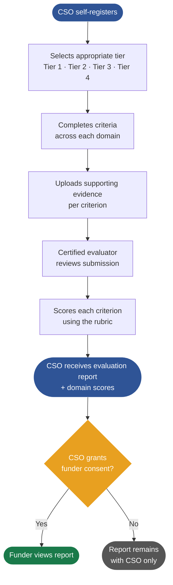

# STEP Framework Overview

**[Visit the STEP landing page on TechSoup](https://step.techsoup.org)**

STEP is a tiered due diligence framework for civil society organizations (CSOs).
It defines assessment criteria and a scoring rubric that allow CSOs to demonstrate
organizational capacity to funders — once, in a reusable format.

STEP is part of TechSoup's strategic effort to open source key components of its infrastructure — including frameworks — so that others can contribute to and build upon them. We believe shared standards should be developed in the open, shaped by the communities they serve. Open sourcing our frameworks is a strategic pillar of this work.

---

## The Eleven Assessment Domains

STEP assesses organizations across 11 domain areas. Each domain represents a critical dimension of organizational health and capacity:

1. **Governance** — Board structure, oversight, conflict of interest, ethics
2. **Financial Controls** — Budgeting, auditing, segregation of duties, asset protection
3. **Legal Compliance** — Adherence to local law, labor law, management structure
4. **Operational Planning and Continuity** — Strategic planning, sustainability, succession
5. **Risk Management** — Risk awareness, emergency planning, anti-corruption, anti-terrorism
6. **Commitment to Community Engagement** — Impartial delivery, inclusiveness, anti-discrimination
7. **Data Security and Privacy** — Cybersecurity, data protection, privacy policies
8. **Safeguarding** — Protection of vulnerable populations, child protection, safe recruitment
9. **Working with Implementing Partners** — Due diligence on downstream partners, supply chain
10. **Human Resources** — *(Coming soon)*
11. **Program Delivery** — *(Coming soon)*

---

## The Four Tiers

STEP uses a tiered model so that small, grassroots organizations can participate
without being held to the same compliance requirements as large, high-capacity agencies.

| Tier   | Name          | Target CSO Profile                          | Domains Assessed      | Typical Use Case                   |
|--------|---------------|---------------------------------------------|-----------------------|------------------------------------|
| Tier 1 | Basic         | Grassroots, early-stage                     | Core domains          | Community grants, small donors     |
| Tier 2 | Foundation    | Established CSO with formal structures      | All published domains | Mid-size grants, program funding   |
| Tier 3 | Agency        | Mature CSO with robust internal systems     | All + extended criteria | Institutional funding, large grants |
| Tier 4 | Plus          | Large-scale, high-capacity organizations    | All + highest bar     | Major institutional funding, UN contracts |

A CSO completes assessment at the tier appropriate to their organization.
Funders specify which tier(s) they accept for a given grant opportunity.

---

## Data Ownership

**CSOs own their assessment data.** This is non-negotiable in the STEP model.

- No data is shared with a funder without explicit CSO consent
- Consent is per-assessment, per-funder, and revocable at any time
- The open framework defines the *structure* of assessment data — the actual
  data lives in compliant implementations, not in this repository

---

## How an Assessment Works

---

## What This Repo Contains

This repository is **the specification only** — not a running application.

| Path               | What's there                                      |
|--------------------|---------------------------------------------------|
| `domains/`         | Assessment criteria and minimum requirements, by domain |
| `docs/`            | Guidance documents (this file, scoring, glossary) |
| `translations/`    | Translated criteria in supported languages        |
| `rfcs/`            | Proposals for changes to the framework            |
