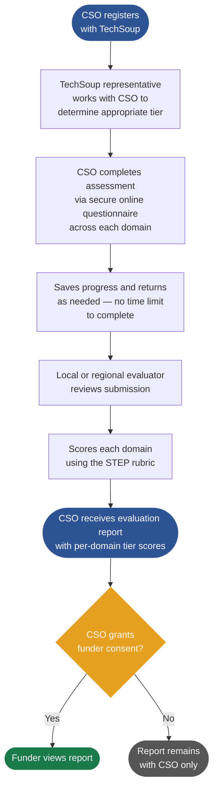

# STEP Framework Overview

**[Visit the STEP landing page on TechSoup](https://step.techsoup.org)**

**STEP — Strengthening and Tiered Evaluation Process** — is a tiered due diligence framework
for civil society organizations (CSOs). It defines assessment criteria that allow CSOs to
demonstrate organizational capacity to funders — once, in a reusable format.

The name reflects two equal purposes. STEP is an evaluation tool, but the "S" comes first:
it is equally a **strengthening** tool — an organizational diagnostic that gives CSOs a
concrete picture of where they stand and a roadmap for building capacity over time.

STEP is part of TechSoup's strategic effort to open source key components of its infrastructure — including frameworks — so that others can contribute to and build upon them. We believe shared standards should be developed in the open, shaped by the communities they serve. Open sourcing our frameworks is a strategic pillar of this work.

---

## The Assessment Domains

STEP assesses organizations across a set of domain areas (referred to as "streams" by
TechSoup). Each domain represents a critical dimension of organizational health
and capacity. Crucially, **each domain is assessed and scored independently** — a CSO
receives a tier rating per domain, not a single org-wide score. This reflects the reality
that organizations often have stronger capacity in some areas than others.

1. **Governance** — Board structure, oversight, conflict of interest, ethics
2. **Financial Controls** — Budgeting, auditing, segregation of duties, asset protection
3. **Legal Compliance** — Adherence to local law, labor law, management structure
4. **Operational Planning and Continuity** — Strategic planning, sustainability, succession
5. **Risk Management** — Risk awareness, emergency planning, anti-corruption, anti-terrorism
6. **Commitment to Community Engagement** — Impartial delivery, inclusiveness, anti-discrimination
7. **Data Privacy and Security** — Cybersecurity, data protection, privacy policies
8. **Safeguarding** — Protection of vulnerable populations, child protection, safe recruitment
9. **Working with Implementing Partners** — Due diligence on downstream partners, supply chain
10. **Human Resources** — *(Coming soon)*
11. **Program Delivery** — *(Coming soon)*

---

## The Four Tiers

STEP uses a tiered model so that small, grassroots organizations can participate
without being held to the same compliance requirements as large, high-capacity agencies.
Tiers are applied per domain — a CSO may reach Tier 3 in Governance while being at
Tier 1 in Risk Management. This domain-by-domain view gives funders and CSOs a
nuanced, accurate picture of organizational maturity.

| Tier   | Name          | Target CSO Profile                          | Typical Use Case                   |
|--------|---------------|---------------------------------------------|------------------------------------|
| Tier 1 | Basic         | Grassroots, early-stage                     | Community grants, small donors     |
| Tier 2 | Foundation    | Established CSO with formal structures      | Mid-size grants, program funding   |
| Tier 3 | Agency        | Mature CSO with robust internal systems     | Institutional funding, large grants |
| Tier 4 | Plus          | Large-scale, high-capacity organizations    | Major institutional funding, UN contracts |

Within each domain, the tiers are additive — Tier 2 criteria include all Tier 1 requirements
plus additional standards. Funders specify which tier(s) they require across relevant domains
for a given funding opportunity.

---

## Data Ownership

**CSOs are the principal beneficiaries of their own assessment data.** This is non-negotiable
in the STEP model.

- No data is shared with a funder without explicit CSO consent
- Consent is per-assessment, per-funder, and revocable at any time
- TechSoup never uses assessment data as a profit-generating or marketing tool — data exists
  solely to serve the CSO's development and funding access
- The open framework defines the *structure* of assessment data — the actual data lives in
  compliant implementations, not in this repository

---

## How an Assessment Works

---

## Assessment Format

The STEP assessment is delivered as a **secure online questionnaire**, available in multiple
languages. Key features of the format:

- Questions use a **select-all-that-apply** structure, broadly framed to accommodate
  different types of organizations ("policies, processes, or documented practices")
- CSOs can **save progress and return** at any time — there is no requirement to complete
  the assessment in a single session
- A TechSoup representative works with the CSO before the assessment begins to confirm
  the appropriate tier for each domain
- Assessments are reviewed by **local or regional evaluators** — TechSoup's network of
  trained evaluators who understand the operating context of the CSO

---

## Exception and Additional Assurance Questions

STEP is designed to be accessible to a wide range of organizations, including those without
formal legal registration or traditional banking arrangements. For CSOs in these circumstances,
the assessment includes **exception questions** — alternative pathways that allow organizations
to demonstrate equivalent practices even where standard documentation does not exist.

This ensures that STEP does not inadvertently exclude the smallest, most community-rooted
organizations — precisely those that the "Strengthening" component of STEP is designed to serve.

---

## What This Repo Contains

This repository is **the specification only** — not a running application.

| Path               | What's there                                      |
|--------------------|---------------------------------------------------|
| `domains/`         | Assessment criteria and minimum requirements, by domain |
| `docs/`            | Guidance documents (this file, scoring, glossary) |
| `translations/`    | Translated criteria in supported languages        |
| `rfcs/`            | Proposals for changes to the framework            |
